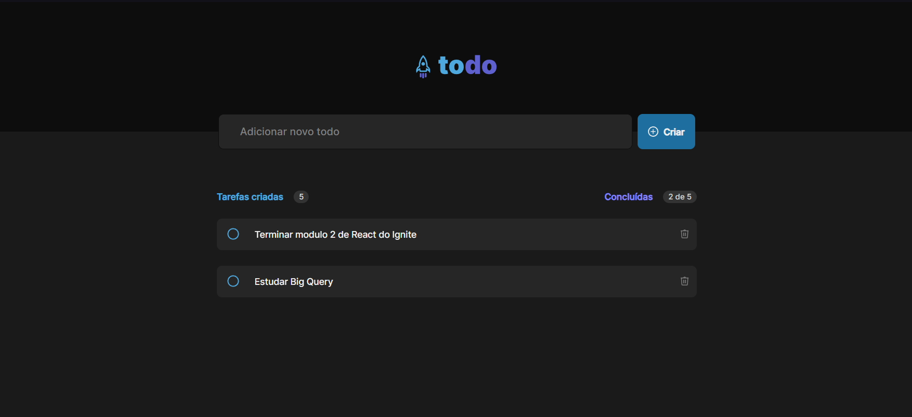

<h1 align="center"> 
	Todo List 🚀
</h1>

<h4 align="center">
    
</h4>

## 💻 Sobre o projeto

Todo List - Projeto que exibe uma lista de tarefas e um status de tarefas concluídas, onde é possível adicionar e remover tarefas.

Layout de Projeto fornecidos pela [Rocketseat].
A partir dessa base, propus implementar algumas funcionalidades a mais para enriquecer o projeto. 

## 🎨 Layout

O layout da aplicação está disponível no Figma:

---

## 💻 Tecnologias utilizadas 

- React.
- Javascript.
- Typescript.
- Styled Components.

---

## ⚙️ Funcionalidades (disponibilizadas pela Rocketseat)

- [x] Layout do FIGMA com o protótipo da tela.
- [x] Criação de todo o HTML e CSS da página exatamente de acordo com o disponibilizado no Figma, incluíndo ícones e avatar.
- [x] Template dos componentes e alguns códigos iniciais.

---

## ⚙️ Funcionalidades Implementadas

- [x] Adicionar a lógica para adicionar uma tarefa.
- [x] Adicionar a lógica para remover uma tarefa.
- [x] Adicionar a lógica para concluir uma tarefa e atualizar o contador.

---

## 📝 Licença

Este projeto esta sobe a licença [MIT](./LICENSE).

Feito por Jessica Monique (pode chamar de Monique 👋🏽) | 
[Linkedin](https://www.linkedin.com/in/jmoniquemelo/)

---
